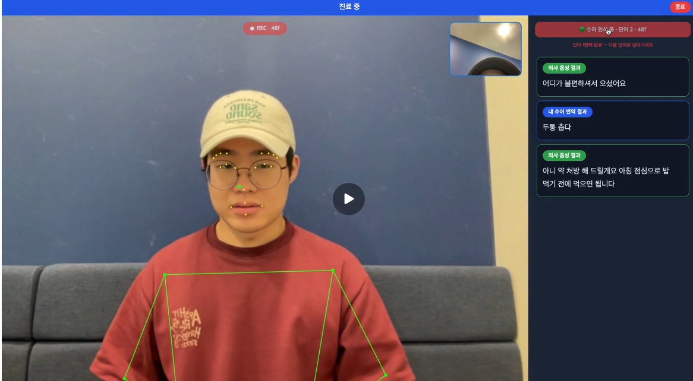
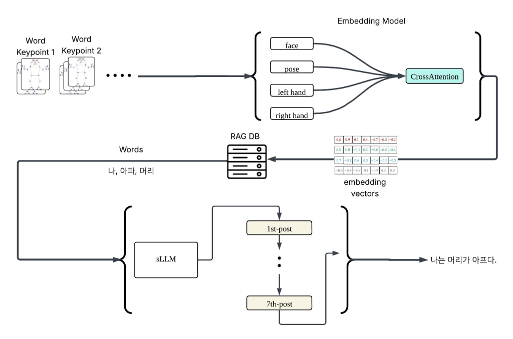
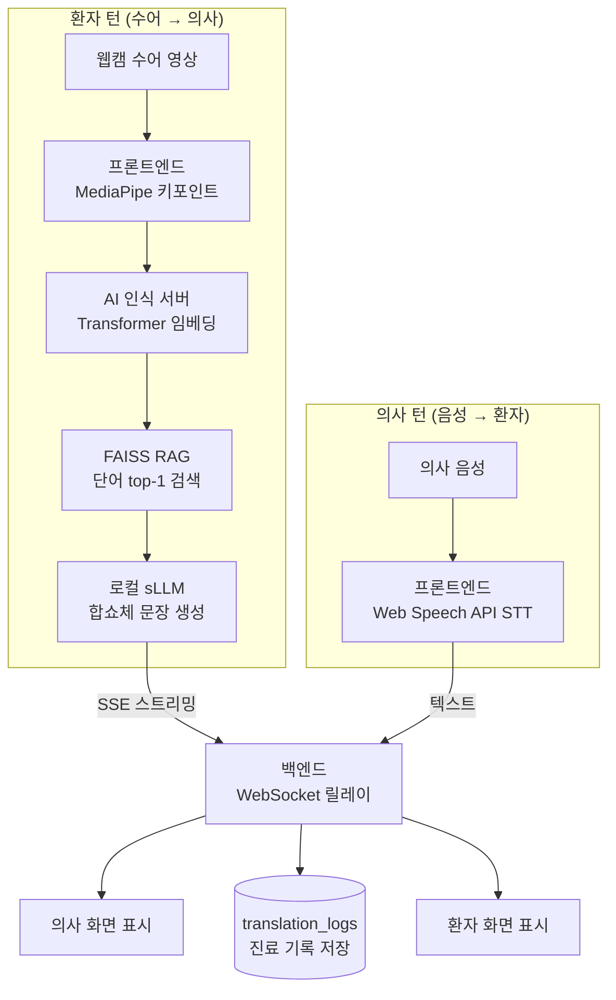
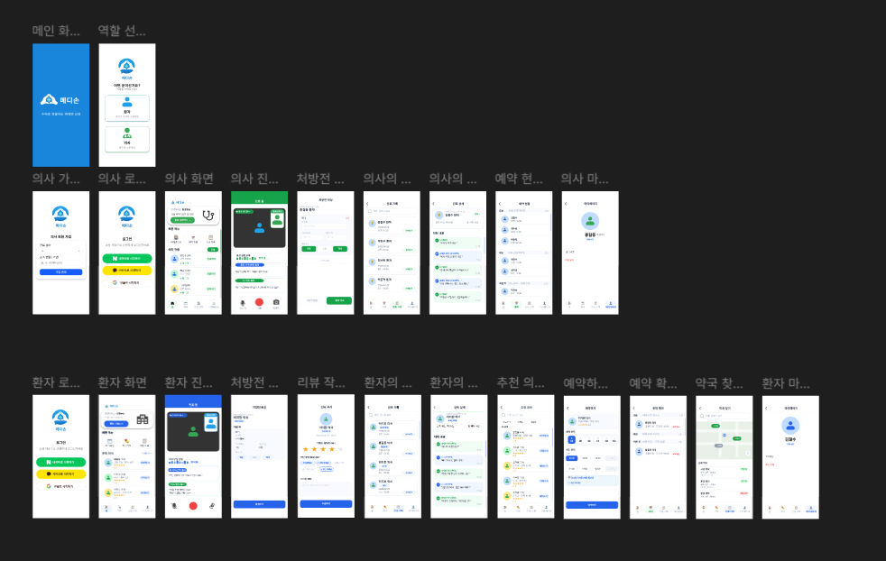

# 메디손 (Medisone)

> **수어로 연결하는 비대면 진료** — RAG 기반 한국 수어(KSL) 번역 비대면 진료 서비스

`서강대학교 SW중심대학사업단 · 캡스톤디자인 (담당교수 장두성)` · `팀 Sign4U (7조)` · `2026.03.02 ~ 2026.06.23`

메디손은 수어를 사용하는 농인(청각장애인)과 의사를 잇는 **양방향 수어 번역 비대면 진료 플랫폼**입니다. 환자의 수어를 실시간으로 인식해 한국어 문장으로 바꿔 의사에게 전달하고, 의사의 음성은 텍스트로 변환해 환자에게 전달합니다. 예약부터 화상진료, 처방, 약국 찾기, 리뷰까지 진료의 전 과정을 하나의 흐름으로 묶은 완결형 서비스입니다.

<p align="center">
  <br/>
  <sub>실시간 수어 인식 화상진료 — 환자의 수어가 한국어로 번역되고, 의사의 음성이 텍스트로 표시됩니다</sub>
</p>

## 목차

- [개요](#개요)
  - [배경 및 문제](#배경-및-문제)
  - [해결책](#해결책)
  - [핵심 특징](#핵심-특징)
  - [배포 / 데모](#배포--데모)
- [시스템 아키텍처](#시스템-아키텍처)
  - [구성 단위](#구성-단위)
  - [양방향 데이터 흐름](#양방향-데이터-흐름)
  - [파이프라인 단계](#파이프라인-단계)
- [주요 기능](#주요-기능)
- [기술 스택](#기술-스택)
- [데이터베이스 스키마](#데이터베이스-스키마)
- [레포지토리 구성](#레포지토리-구성)
- [시작하기 (로컬 실행)](#시작하기-로컬-실행)
  - [사전 요구사항](#사전-요구사항)
  - [백엔드 (web-Backend)](#백엔드-web-backend--nodejs--express-5)
  - [프론트엔드 (web-UI)](#프론트엔드-web-ui--react-19--vite)
  - [AI 인식 서버 (AI-Embedding)](#ai-인식-서버-ai-embedding--fastapi--pytorch--faiss)
  - [AI-sLLM 서버 (AI-sLLM)](#ai-sllm-서버-ai-sllm--exaone-35-24b--qlora-4bit)
  - [환경 변수](#환경-변수)
- [결과 및 평가](#결과-및-평가)
  - [단어 인식 성능](#단어-인식-성능)
  - [sLLM 문장 생성 성능](#sllm-문장-생성-성능)
  - [추론 환경](#추론-환경)
- [팀 구성](#팀-구성)
- [감사의 글 / 소속](#감사의-글--소속)

## 개요

### 배경 및 문제

- 국내 농인(청각장애인)은 약 **40만 명**에 이르지만, 병원을 이용할 때마다 수어 통역사를 구해야 합니다. 통역사 부족·비용·일정 문제로 현실적으로 쉽지 않습니다.
- 닥터나우 등 기존 비대면 진료 서비스는 음성·텍스트 입력을 전제로 하기 때문에 수어 사용자가 사실상 이용할 수 없습니다. 손말이음 같은 사람 중계 서비스도 통역사가 없는 시간대에는 연결되지 않습니다.
- 결국 **'언제든·직접·수어로'** 의사와 소통할 수 있는 수단이 비어 있습니다.

### 해결책

메디손은 수어 사용자와 의사를 잇는 **수어 기반 양방향 비대면 진료 플랫폼**입니다.

- **환자의 수어** → 실시간 키포인트 추출 → AI 단어 인식 → sLLM 문장 생성 → 의사에게 전달
- **의사의 음성** → STT로 텍스트화 → 환자에게 전달
- 모든 대화는 **진료 기록으로 저장**되며, 예약·화상진료·처방 메모·약국 찾기·리뷰까지 진료의 전 과정을 하나의 흐름으로 연결합니다.

### 핵심 특징

- **CPU만으로 동작** — GPU 없이 CPU만으로 수어 인식이 가능하도록 파이프라인을 경량화해, 별도 인프라 없이 배포할 수 있습니다.
- **RAG 기반 확장성** — FAISS 벡터 DB를 도입해 모델 재학습 없이 어휘 DB만 교체하면 의료 외 다른 도메인으로 확장할 수 있습니다.
- **완결형 서비스** — 단순 번역 도구가 아니라 로그인·예약·화상진료·처방·약국·리뷰까지 연결된 완결형 진료 서비스입니다.

### 배포 / 데모

- **서비스 데모**: [medisone.vercel.app](https://medisone.vercel.app) (도메인 표기는 `medisone`)

> 📹 **데모 영상**: _(시연 영상 링크 추가 예정 — YouTube / Google Drive)_

## 시스템 아키텍처

메디손(Medisone)은 역할별로 분리된 **5개의 독립 배포 단위**로 구성됩니다. 프론트엔드에서 수어 키포인트를 추출하고, AI 인식 서버가 단어를 인식한 뒤, 로컬 sLLM이 **7단계 제어 추론 파이프라인**을 거쳐 자연스러운 한국어 문장을 생성해 의사에게 전달합니다. 의사의 음성은 STT로 텍스트화되어 환자에게 돌아오는 **양방향 구조**입니다.

<p align="center">
  <br/>
  <sub>수어 키포인트 → 4-스트림 Cross-Attention 임베딩 → FAISS RAG 검색 → sLLM 7단계 문장 생성</sub>
</p>

### 구성 단위

| 구성요소 | 기술 / 배포 | 역할 |
|---|---|---|
| **프론트엔드** (web-UI) | React 19 + Vite / Vercel (medisone.vercel.app) | MediaPipe Holistic 키포인트 추출(웹캠 15fps), 실시간 번역 표시, WebRTC 화상통화, Web Speech API STT(ko-KR) |
| **Node.js 백엔드** (web-Backend) | Express 5 / Railway | OAuth·JWT 인증(Passport.js: Kakao/Google/Naver), 예약·진료·처방·리뷰 비즈니스 로직, REST API 35종, WebSocket(ws) 릴레이, AI 서버 프록시, pg 커넥션 풀 |
| **AI 인식 서버** (AI-Embedding) | FastAPI + PyTorch + FAISS / Railway | MediaPipe 키포인트 → 4-스트림 Cross-Attention Transformer 임베딩(대조학습, NT-Xent) → FAISS RAG 단어 검색(코사인 유사도) → sLLM 호출 → SSE 스트리밍 |
| **로컬 sLLM 서버** (AI-sLLM) | FastAPI + transformers·PEFT / ngrok 터널 | EXAONE 3.5 2.4B + LoRA(QLoRA 4bit NF4) 추론으로 수어 단어 나열을 7단계 제어 추론 파이프라인을 거쳐 자연스러운 합쇼체 한국어 문장으로 변환, JSON 입출력 |
| **데이터베이스** | PostgreSQL / Supabase 호스팅 | 환자·의사·예약·진료기록·처방·리뷰·번역 로그 영구 저장 (web-Backend가 사용) |

### 양방향 데이터 흐름



### 파이프라인 단계

**환자 턴 (수어 → 의사):**
1. **수어 캡처** — 프론트엔드가 웹캠 영상에서 MediaPipe Holistic으로 키포인트를 추출합니다.
2. **단어 인식** — AI 인식 서버가 키포인트를 4-스트림 Cross-Attention Transformer로 임베딩합니다.
3. **RAG 검색** — FAISS 벡터 DB에서 코사인 유사도로 단어를 top-1 검색합니다.
4. **문장 생성** — 로컬 sLLM(EXAONE 3.5 2.4B + LoRA)이 7단계 제어 추론 파이프라인을 거쳐 단어 나열을 합쇼체 한국어 문장으로 변환합니다.
5. **전달·저장** — SSE 스트리밍으로 백엔드 WebSocket 릴레이를 거쳐 의사 화면에 표시되고, 동시에 `translation_logs`에 진료 기록으로 저장됩니다.

**의사 턴 (음성 → 환자):**
1. **음성 인식** — 프론트엔드의 Web Speech API STT(ko-KR)가 의사 음성을 텍스트로 변환합니다.
2. **전달** — 백엔드 릴레이를 거쳐 환자 화면에 표시됩니다.

## 주요 기능

<p align="center">
  <br/>
  <sub>메디손 주요 화면 — 역할 선택, 의사·환자 홈, 화상진료, 처방, 약국 찾기, 리뷰</sub>
</p>

- **소셜 로그인 3종** — Kakao · Google · Naver OAuth로 간편 로그인하며, 인증 후 JWT(Stateless, 7일 만료)로 세션을 유지합니다.
- **의사·진료과 탐색** — 진료과 목록에서 원하는 과를 고르고, 병원명·경력·평균 평점과 함께 의사를 살펴봅니다.
- **슬롯 예약** — 원하는 날짜와 시간 슬롯을 선택해 진료를 예약합니다. 예약 상태는 PENDING → IN_PROGRESS → COMPLETED/EXPIRED 흐름으로 관리됩니다.
- **WebRTC 화상진료 (턴 기반)** — 의사 발화와 환자 수어가 번갈아 진행되는 턴 기반 화상통화로 진료를 시작합니다. 환자는 "수어 시작" 버튼을 누르고 2초 카운트다운 후 수어를 녹화합니다.
- **실시간 번역 / STT 표시** — 환자의 수어는 실시간으로 한국어로 번역되어 표시되고, 의사의 음성은 STT(Web Speech API, ko-KR)로 텍스트화되어 환자 화면에 표시됩니다.
- **처방 메모** — 의사가 처방 내용을 메모로 작성하고, 환자가 이를 확인합니다.
- **약국 찾기** — 처방 확인 후 가까운 약국을 찾아봅니다.
- **리뷰** — 진료가 끝나면 별점·태그·내용으로 진료 리뷰를 남깁니다 (진료 1건당 1회).
- **진료기록 저장** — 모든 대화는 화자 구분·신뢰도와 함께 `translation_logs`에 진료 기록으로 영구 저장됩니다.

## 기술 스택

| 레이어 | 기술 |
|--------|------|
| 프론트엔드 | React 19, Vite, React Router, Axios |
| 수어 캡처 | MediaPipe Holistic (웹캠 15fps 키포인트 추출) |
| 실시간 통신 | WebRTC(영상), WebSocket(시그널링·번역 결과 릴레이), SSE(번역 스트리밍) |
| 음성 인식(STT) | Web Speech API (의사 음성, ko-KR) |
| 백엔드(API) | Node.js + Express 5, JWT, Passport(OAuth 3종: Kakao/Google/Naver), REST API 35종 |
| AI 인식 서버 | FastAPI, PyTorch, FAISS(IndexFlatIP) |
| 임베딩 모델 | 4-스트림 Cross-Attention Transformer + 대조학습(NT-Xent, 12전략 비교) |
| sLLM(번역) | EXAONE 3.5 2.4B + LoRA(QLoRA 4bit NF4), transformers/PEFT (로컬 4bit 구동) |
| 데이터베이스 | Supabase PostgreSQL |
| 인프라/배포 | Vercel(프론트), Railway(백엔드·인식 서버), ngrok(로컬 sLLM 터널) |
| 협업 도구 | Notion(API 명세·회의록), dbdiagram.io(DBML ERD), Postman(API 테스트), GitHub Actions |

## 데이터베이스 스키마

PostgreSQL(Supabase 호스팅) 기반이며, web-Backend가 사용하는 주요 테이블은 다음과 같습니다.

| 테이블 | 설명 |
|--------|------|
| `patients` | 환자 계정 (OAuth provider/id, 이름, 프로필) |
| `doctors` | 의사 계정 (진료과 FK, 병원명, 경력, 평균 평점) |
| `specialties` | 진료과 목록 (id, 이름, 아이콘) |
| `consultations` | 진료 예약 (환자·의사 FK, 예약/시작/종료 시각, 상태 PENDING→IN_PROGRESS→COMPLETED/EXPIRED) |
| `consultation_records` / `prescriptions` | 진료 기록 / 처방전 항목 |
| `reviews` | 진료 리뷰 (별점·태그·내용, consultation당 1건 UNIQUE) |
| `translation_logs` | 수어 번역·음성 텍스트 기록 (화자 구분, 신뢰도) |

## 레포지토리 구성

본 프로젝트는 5개의 독립 배포 단위를 4개의 GitHub 레포지토리로 분리한 **멀티레포(multi-repo) 구조**로 개발되었습니다. 모든 레포지토리는 조직 [`Sogang-Capstone-2026-1`](https://github.com/Sogang-Capstone-2026-1) 아래에 있으며, 프론트엔드·백엔드·AI 인식·AI 문장 생성의 네 모듈이 명확히 분리되어 독립적으로 개발·배포됩니다.

| 레포 | 모듈 | 주요 기술 | 담당 |
|------|------|-----------|------|
| **web-Backend** | 백엔드 (API·인증·실시간 릴레이) | Node.js, Express 5, JWT, Passport(OAuth 3종), WebSocket, PostgreSQL(Supabase) | Jumagul Alua |
| **web-UI** | 프론트엔드 (수어 캡처·번역 표시·화상진료) | React 19, Vite, MediaPipe Holistic, WebRTC, Web Speech API | Shunn Lae Ko Ko Aye |
| **AI-Embedding** | AI 인식 (수어 단어 인식) | FastAPI, PyTorch, Cross-Attention Transformer, FAISS RAG | 최원창 (팀장) |
| **AI-sLLM** | AI 문장 생성 (단어 시퀀스 → 문장) | FastAPI, transformers, PEFT, EXAONE 3.5 2.4B + QLoRA 4bit, 7단계 제어 추론 파이프라인 | Yang Chunxuan |

**각 레포 설명**

- **web-Backend** — Node.js + Express 5 백엔드. 인증·예약·진료·처방·리뷰 비즈니스 로직과 WebSocket 릴레이, AI 서버 프록시, PostgreSQL 데이터베이스를 담당합니다.
- **web-UI** — React 19 + Vite 프론트엔드. 웹캠 수어 캡처, 실시간 번역 표시, WebRTC 화상진료, 의사 음성 STT를 담당합니다.
- **AI-Embedding** — 수어 단어 인식 AI 서버. MediaPipe 키포인트를 Transformer로 임베딩하고 FAISS 벡터 DB에서 단어를 검색(RAG)합니다. 주요 파일: `model.py`(Transformer 인코더), `faiss_db.py`(FAISS RAG), `preprocess.py`(MediaPipe 전처리), `data.py`, `evaluate.py`, `experiments.py`(12전략 실험), `run.py`, `sweep.py`, `server/`(FastAPI 추론 서버), `local_sLLM/`, `demo/`·`demo-desktop/`.
- **AI-sLLM** — sLLM 후처리 모듈. 인식된 수어 단어 시퀀스를 EXAONE 3.5 2.4B + LoRA로 7단계 제어 추론 파이프라인을 거쳐 자연스러운 합쇼체 한국어 문장으로 변환합니다. 주요 파일: `sllm_module.py`, `evaluate.py`, `prompt_templates.py`, `requirements.txt`, `scripts/`.

## 시작하기 (로컬 실행)

메디손(Medisone)은 5개의 독립 배포 단위(프론트엔드 · Node.js 백엔드 · AI 인식 서버 · 로컬 sLLM 서버 · PostgreSQL DB)로 구성되며, 4개의 GitHub 레포(조직: `Sogang-Capstone-2026-1`)에 나뉘어 있습니다. 아래는 각 모듈을 로컬에서 실행하는 방법입니다.

### 사전 요구사항

- **Node.js** — 백엔드(Express 5) 및 프론트엔드(React 19 + Vite) 실행
- **Python** — AI 인식 서버(FastAPI + PyTorch + FAISS) 및 sLLM 서버(transformers + PEFT) 실행
- **PostgreSQL / Supabase 계정** — 데이터베이스(Supabase 호스팅)
- **OAuth 앱 키** — 소셜 로그인 3종(Kakao / Google / Naver)의 client id / secret
- **AI 어댑터 가중치** — sLLM의 LoRA 어댑터 가중치는 용량 문제로 레포에 포함되지 않으며, **Google Drive 공유 링크**로 별도 배포됩니다.

### 백엔드 (web-Backend · Node.js + Express 5)

```bash
npm install
npm run dev     # 개발 (nodemon)
# npm start     # 운영
```

### 프론트엔드 (web-UI · React 19 + Vite)

```bash
npm install
npm run dev       # 개발 서버
# npm run build   # 프로덕션 빌드
# npm run preview # 빌드 결과 미리보기
```

### AI 인식 서버 (AI-Embedding · FastAPI + PyTorch + FAISS)

> 주의: 레포 루트에는 `requirements.txt`가 없습니다. 의존성 및 실행 진입점은 `server/` 디렉터리를 참고하세요.

```bash
# Python 환경에서 의존성 설치 후, server/의 FastAPI 서버를 uvicorn으로 구동
cd server
uvicorn main:app --reload
```

### AI-sLLM 서버 (AI-sLLM · EXAONE 3.5 2.4B + QLoRA 4bit)

```bash
pip install -r requirements.txt
python -X utf8 sllm_module.py --words 나 학교 오늘 가다
```

> 룰 기반 백엔드는 GPU가 필요 없습니다. LoRA 어댑터 가중치는 용량 문제로 **Google Drive**를 통해 공유됩니다.

### 환경 변수

각 모듈에서 필요한 환경 변수는 다음과 같습니다. (백엔드·프론트 키는 Railway 대시보드에 등록)

**백엔드 (web-Backend)**

| 키 | 설명 |
|----|------|
| `KAKAO_CLIENT_ID` / `KAKAO_CLIENT_SECRET` | Kakao OAuth |
| `GOOGLE_CLIENT_ID` / `GOOGLE_CLIENT_SECRET` | Google OAuth |
| `NAVER_CLIENT_ID` / `NAVER_CLIENT_SECRET` | Naver OAuth |
| `JWT_SECRET` | JWT 서명 시크릿 |
| `DATABASE_URL` | DB 연결 문자열 (Supabase PostgreSQL) |
| `AI_SERVER_URL` | AI 인식 서버 URL |
| TURN 자격증명 (`metered.live`) | WebRTC TURN 서버 자격증명 |
| CORS 화이트리스트 | 허용 오리진 목록 |

**프론트엔드 (web-UI)**

| 키 | 설명 |
|----|------|
| 백엔드 API URL | 백엔드 REST API 주소 |
| `FRONTEND_URL` | OAuth 콜백용 프론트엔드 주소 |

**로컬 sLLM 서버 (AI-sLLM)**

| 키 | 설명 |
|----|------|
| ngrok 토큰 | ngrok 터널 인증 토큰 |
| 어댑터 경로 | LoRA 어댑터 가중치 경로 |

## 결과 및 평가

### 단어 인식 성능

실제 촬영한 도메인 테스트셋(51단어, 152샘플)을 기준으로 평가했습니다. 목표였던 Top-1 70% / Top-3 85%에는 미치지 못했으며, 이는 학습 데이터(AI Hub)와 실제 서비스 환경 사이의 도메인 격차를 드러냅니다.

| 평가 셋 | 규모 | Top-1 | Top-3 / Top-5 |
|---|---|---|---|
| 실촬영 테스트셋 | 51단어 · 152샘플 | **0.664** | **0.796** (Top-3) |
| AI Hub 학습 분포(참고) | 3,000단어 · 약 54,000샘플 · 100 epoch | 0.863 | 0.973 (Top-5) |

> AI Hub 분포 내(테스트셋 9,000개)에서는 Top-1 0.863 / Top-5 0.973으로 높은 성능을 보였으나, 실촬영 환경에서는 성능이 하락했습니다. 목표 대비 미달인 점을 솔직히 기록하며, 학습-서비스 도메인 격차가 주요 원인으로 확인되었습니다.

### sLLM 문장 생성 성능

수어 단어 시퀀스를 합쇼체 한국어 문장으로 변환하는 sLLM(EXAONE 3.5 2.4B + LoRA)을 테스트 96문장으로 평가했습니다.

| 지표 | 결과 |
|---|---|
| 합쇼체 변환율 | 100% |
| 영어 혼입 | 0% |
| 핵심 키워드 복원율 | 92.6% |
| LLM-심사 수용 가능률 | 약 69% |
| 실측 환각률 | 약 6% |
| 추론 속도 | 0.36초 / 문장 |

### 추론 환경

| 항목 | 내용 |
|---|---|
| 구동 환경 | CPU-only 동작 확인 (GPU 불필요) |
| End-to-End 지연 | 약 1~2초 (로컬 sLLM 분리 구성 기준) |

GPU 없이 CPU만으로 전체 파이프라인이 동작함을 확인했으며, 로컬 sLLM을 분리한 구성에서 입력부터 문장 출력까지 약 1~2초의 응답 지연을 달성했습니다.

## 팀 구성

| 이름 | 역할 | 담당 레포 |
| --- | --- | --- |
| 최원창 (팀장) | AI/ML 수어 인식 — MediaPipe 키포인트, 대조학습 Transformer 인코더, FAISS 벡터 DB, FastAPI 인식 서버 | `AI-Embedding` |
| Yang Chunxuan | AI/ML 문장 생성(sLLM) — EXAONE 3.5 2.4B LoRA 파인튜닝, 7단계 추론 파이프라인, 모듈 간 JSON 인터페이스 | `AI-sLLM` |
| Jumagul Alua | 백엔드 — Node.js 서버, OAuth·JWT 인증, REST API 35종, WebSocket 릴레이, PostgreSQL 설계, Railway 배포 | `web-Backend` |
| Shunn Lae Ko Ko Aye | 프론트엔드 — Figma UI/UX, React 화면, MediaPipe·WebRTC 연동, Web Speech API STT, Vercel 배포 | `web-UI` |

**멘토:** 박준혁 (SK hynix, 연구원) — 데모/발표 전략 및 RAG·벡터DB·sLLM 운영 지도

## 시연 영상
https://drive.google.com/file/d/1uzLcZOOxGUr6Jf3wNw8zB82TU97NOYkm/view?usp=sharing

## 감사의 글 / 소속

본 프로젝트는 **서강대학교 SW중심대학사업단 캡스톤디자인** (담당교수 **장두성**, 2026-1학기) 교과목의 일환으로 수행되었습니다.

서비스 데모·발표 전략과 RAG·벡터DB·sLLM 운영 전반에 걸쳐 지도해 주신 기업 멘토 **박준혁 연구원(SK hynix)** 께 깊이 감사드립니다.
