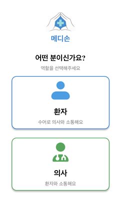
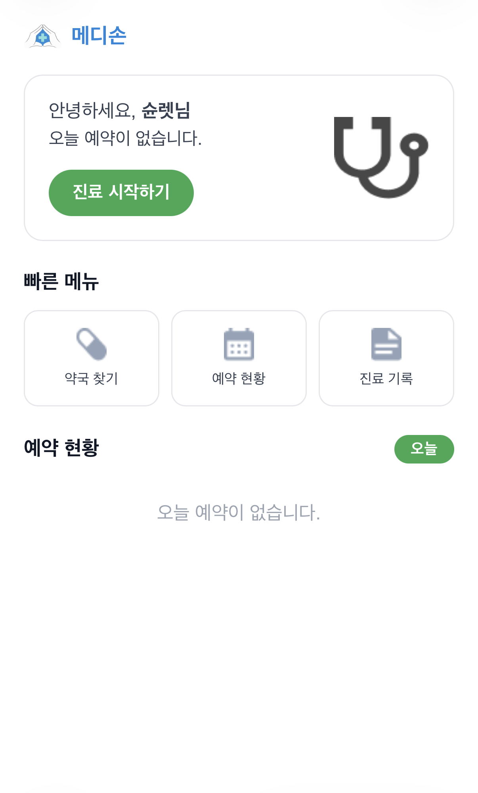
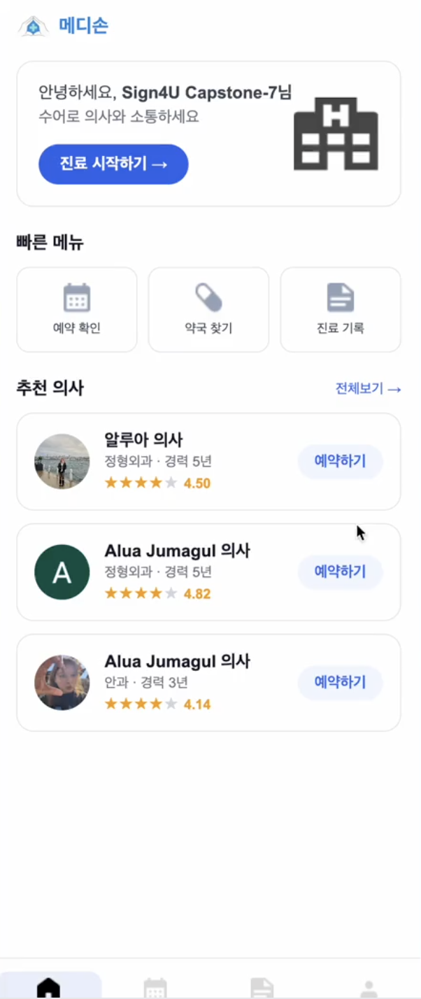
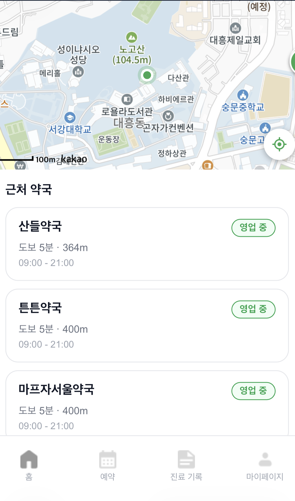
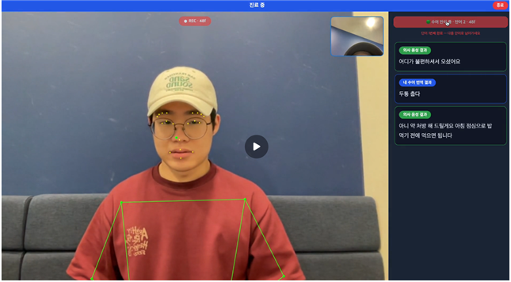

# 메디손 (MediSone) — Frontend

> RAG 기반 한국 수어 번역 비대면 진료 서비스- 프론트엔드

🔗 ** 배포 링크** : https://medisone.vercel.app

---

## 소개

청각장애인(수어 사용자)과 의사를 잇는 비대면 진료 서비스의 프론트엔드입니다.
환자는 수어로 증상을 전달하고, 의사는 음성으로 답변하며 실시간 번역을 통해 소통합니다.

---

## 서비스 흐름

1. 소셜 로그인 후 환자/의사 역할 선택
2. 환자: 진료과 선택 → 의사 선택 → 예약
3. 화상진료 입장 → 수어 시작 버튼 클릭 → 2초 카운트다운 후 수어 인식
4. MediaPipe가 키포인트 추출 → AI 서버에서 번역 → 의사 화면에 텍스트 표시
5. 의사 음성 → STT 변환 → 환자 화면에 표시
6. 진료 종료 → 처방전 확인 → 약국 찾기 → 리뷰 작성

---

## 주요 화면

**역할 선택 · 의사 홈**

<p>


</p>

**환자 홈 · 약국 찾기**

<p>


</p>

**화상진료**

<p>

</p>

---

## 기술 스택

| 분류            | 기술                         |
| --------------- | ---------------------------- |
| 프레임워크      | React 18 + Vite (JavaScript) |
| 라우팅          | react-router-dom             |
| HTTP 클라이언트 | axios                        |
| 수어 인식       | MediaPipe Holistic (CDN)     |
| 화상통화        | WebRTC                       |
| 음성 인식       | Web Speech API               |
| 지도            | Kakao Maps API               |
| 배포            | Vercel                       |

---

## 주요 기능

- 소셜 로그인 (카카오 / 구글 / 네이버)
- 의사 검색 및 진료 예약
- WebRTC 기반 화상진료
- MediaPipe 수어 키포인트 실시간 추출 및 시각화
- 의사 음성 인식 (Web Speech API STT)
- 처방전 확인
- 약국 찾기 (Kakao Maps)
- 진료 기록 조회
- 진료 후기 작성

---

## 화면 구성

| 역할 | 주요 화면                                                             |
| ---- | --------------------------------------------------------------------- |
| 공통 | Splash, 역할 선택, 소셜 로그인                                        |
| 환자 | 홈, 의사 목록, 예약, 화상진료, 진료기록, 처방전, 약국찾기, 마이페이지 |
| 의사 | 홈, 스케줄, 화상진료, 진료기록, 처방전 작성, 마이페이지               |

---

## 실행 방법

```bash
git clone https://github.com/Sogang-Capstone-2026-1/web-UI.git
cd web-UI
npm install
npm run dev
```

### 환경 변수 설정

프로젝트 루트에 `.env` 파일을 생성 후 아래 내용을 입력하세요:

```
VITE_API_BASE_URL=
VITE_WS_URL=
VITE_KAKAO_MAP_KEY=
VITE_PAUSE_THRESHOLD=
VITE_PAUSE_PERIOD=
```

---

## 프로젝트 구조

```
src/
├── api/ # axios 인스턴스, WebSocket 모듈
├── hooks/ # useWebRTC, useSignRecorder
├── pages/ # 화면 컴포넌트
│ ├── Doctor/ # 의사 화면
│ ├── Patient/ # 환자 화면
│ └── Common/ # 공통 화면 (VideoCall 등)
└── utils/ # 키포인트 유틸
```

---
